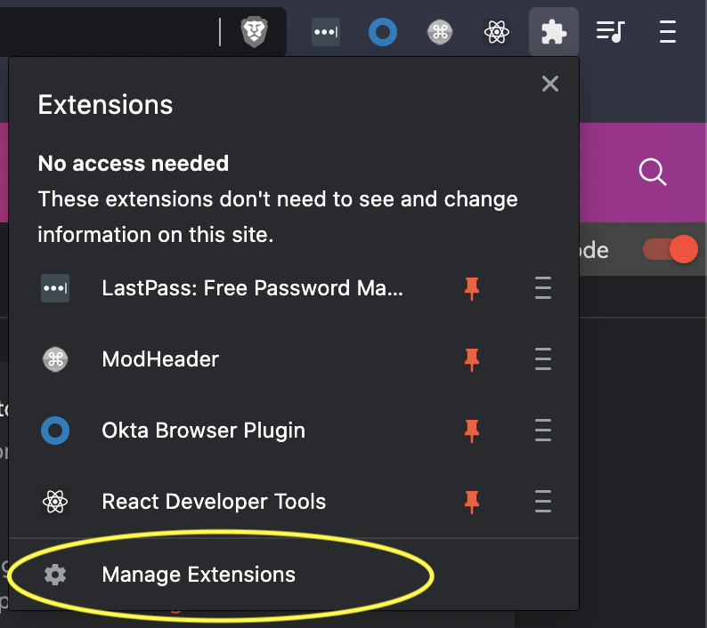
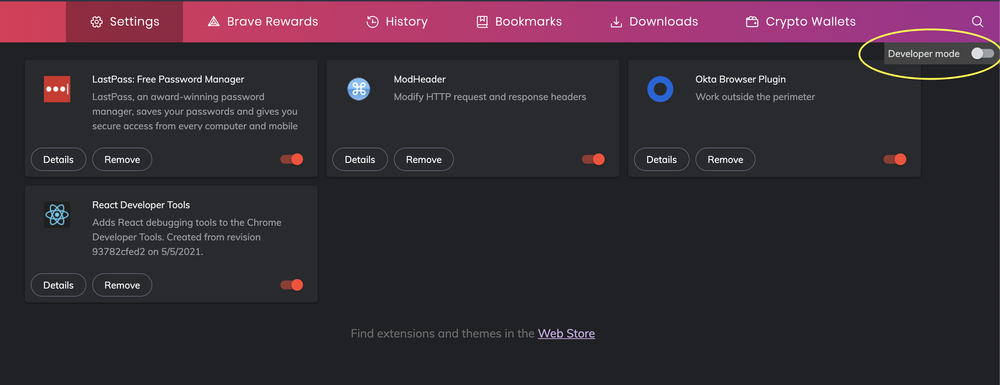
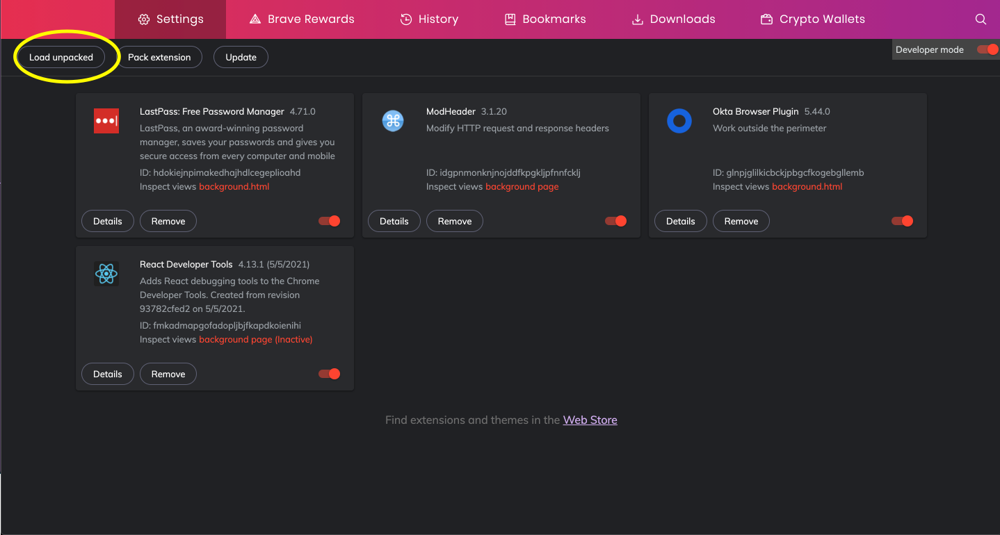
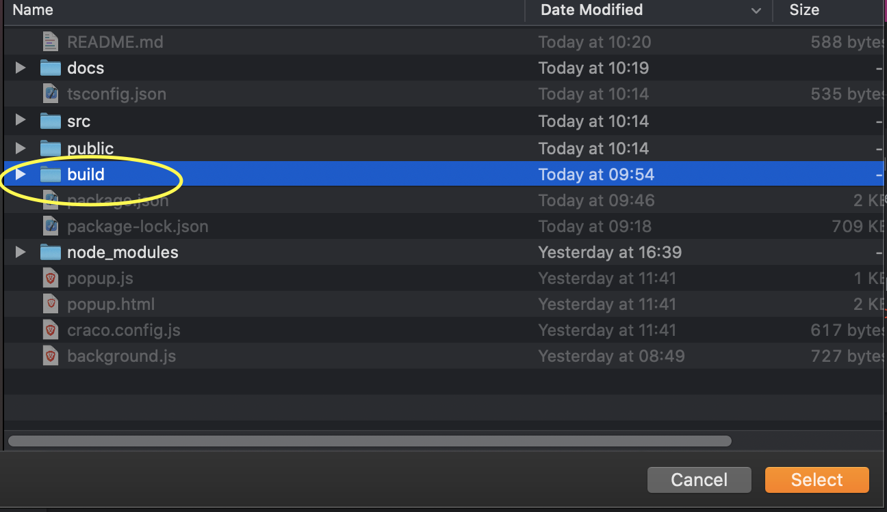
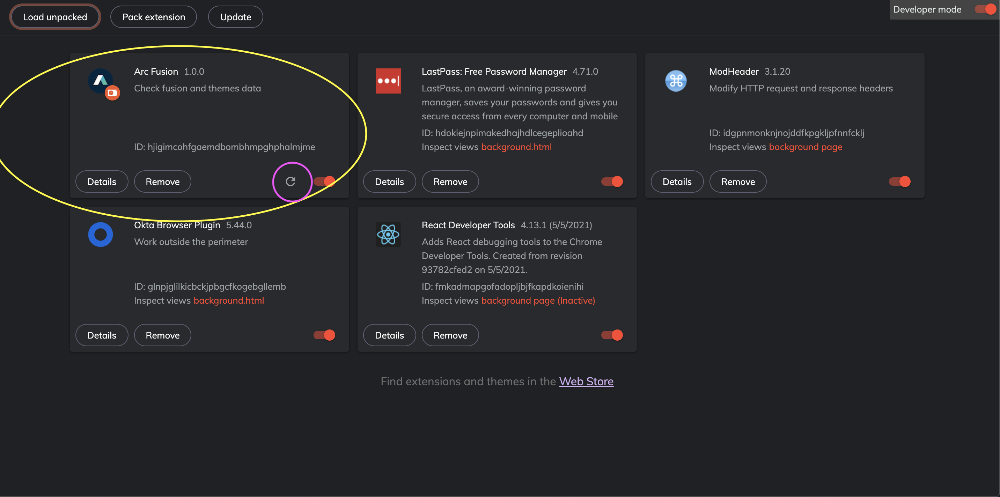
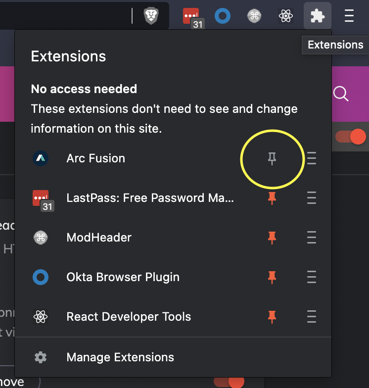
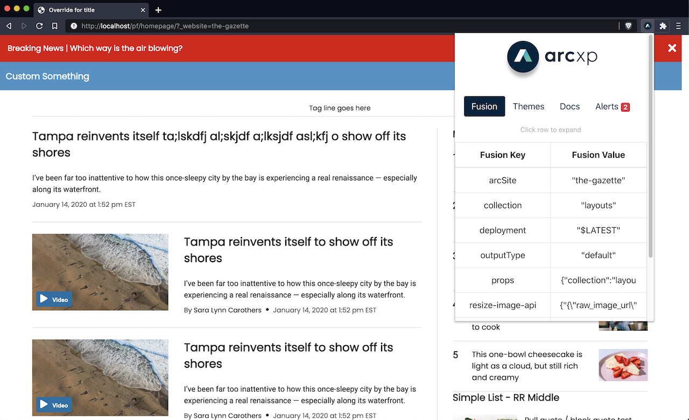

# Fusion Browser Extension

## How To Use

### Go to Chrome Web Store 

The submission is currently being reviewed. The link will be posted when approved.
### Load unpacked

1. In your Terminal, run `cd && git clone https://github.com/wapopartners/Fusion-Browser-Extension`
2. `cd Fusion-Browser-Extension && npm i && npm run build`
3. Go to your Chrome or Chromium-based browser (e.g., Brave) extension panel. Click the `Manage Extensions` button.
   
4. Ensure you have toggled on 'Developer mode'
   
5. Press button 'Load unpacked' button
   
6. Choose 'build' folder in the Fusion-Browser-Extension folder. (If you do not see the build folder here, please run `cd && cd Fusion-Browser-Extension && npm i && npm run build`. The build command creates the build folder.)
   
7. Now that the extension is loaded, you should see the icon in your extensions. 
   NOTE: If you're a developer whose working on the extension, you can make a change then re-run `npm run build`. And, if you click the refresh button (circled in pink), you will see that change manifested.
8. To use the extension's user interface, the extension needs to be pinned to your top-menu. 
   
9. Go to a page with fusion 2.8 with message posting. Click the extension to see content shared from fusion engine, including distribution tag and engine version, that was not previously accessible on the window.Fusion object. You can also see window.Fusion data like global content.
  